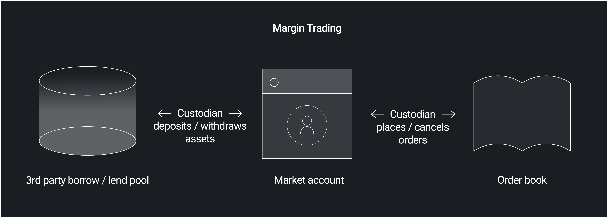

# Market accounts

- [Market accounts](#market-accounts)
  - [General](#general)
  - [Custodians](#custodians)
  - [Market account ID](#market-account-id)
  - [Collateral](#collateral)
  - [Margin trading](#margin-trading)

## General

Once a market has been [registered], users can register a corresponding [`MarketAccount`], from which they can deposit and withdraw assets, and manage limit or market orders.
Similar to a brokerage account, a [`MarketAccount`] tracks a user's outstanding bids and asks, as well as their total base and quote asset holdings.
Before a user can place a limit or a market order, they must have sufficient holdings, which are marked unavailable for withdrawal until:

1. The order is filled, or
1. The order is cancelled

For example, consider a user who opens a [`MarketAccount`] with base asset `APT`, quote asset `USDC`, lot size 1 and tick size 1.
They deposit 100 `USDC` the submit a bid of size 1 and price 100, which locks up all of their `USDC`.
If they cancel the trade they can withdraw all their `USDC`, or, if the trade is filled, they will then be able to withdraw 1 `APT`.

Holdings are routed directly between a user's [`MarketAccount`] and a counterparty's [`MarketAccount`] during a trade.

A [`MarketAccount`] is required to place a limit or a market order, but is not required for a swap, which executes directly against a market.

## Custodians

A user can open more than one [`MarketAccount`] for a given market, each with a different "general custodian ID", corresponding to the [`CustodianCapability`] required to place or cancel orders and withdrawal coin assets on a user's behalf.
The general custodian ID for a given [`MarketAccount`] is marked [`NO_CUSTODIAN`] in the case that a user wishes to sign for each order they place or cancel, as well as for every coin asset withdrawal.
No custodian is required for a coin asset deposit.

Note that this is different from a [generic asset transfer custodian ID], which is a market-wide ID required to approve deposits and withdrawals for generic assets, regardless of a user's general custodian ID.

A general custodian ID overrides a generic asset transfer ID when placing orders and withdrawing coin assets, and a generic asset transfer custodian ID overrides a general custodian ID when depositing or withdrawing generic assets:

| General custodian ID | Generic asset transfer custodian ID | Operation                      | Required authority |
|----------------------|-------------------------------------|--------------------------------|--------------------|
| 123                  | 456                                 | Place/cancel limit order       | Custodian 123      |
| 123                  | 456                                 | Deposit generic base asset     | Custodian 456      |
| 123                  | 456                                 | Deposit coin quote asset       | None               |
| 123                  | 456                                 | Withdraw coin quote asset      | Custodian 123      |
| [`NO_CUSTODIAN`]     | 789                                 | Place market order             | Signing user       |
| [`NO_CUSTODIAN`]     | 789                                 | Withdraw generic base asset    | Custodian 789      |
| [`NO_CUSTODIAN`]     | 789                                 | Deposit coin quote asset       | None               |
| [`NO_CUSTODIAN`]     | 789                                 | Withdraw coin quote asset      | Signing user       |
| [`NO_CUSTODIAN`]     | [`PURE_COIN_PAIR`]                  | Withdraw coin base asset       | Signing user       |

## Market account ID

Internally, Econia uses a [market account ID] to uniquely specify a user's [`MarketAccount`] for a given {market ID, general custodian ID} tuple.
This can be generated via [`get_market_account_id`], and is used as an index in a user's [`MarketAccounts`].

## Collateral

If a given [`MarketAccount`] has a coin asset, then a corresponding [`Collateral<CoinType>`] entry will be generated upon market account registration.
This is where the actual `aptos_framework::coin::Coin` resources are held as collateral, with additional indexing values maintained in the corresponding [`MarketAccount`].

## Margin trading

A straightforward use case for Econia's general custodian paradigm is margin trading:
a third-party integrator acts as the general custodian for a user's [`MarketAccount`], depositing assets borrowed from an external lending pool.
Those assets can then be held as collateral for limit orders, and in the case of a liquidation event, the general custodian simply cancels a user's limit orders, withdraws the underlying collateral, and returns the proceeds to lenders, who enabled such leverage in the first place.

<!---Alphabetized reference links-->

[`Collateral<CoinType>`]:              ../../../src/move/econia/build/Econia/docs/user.md#0xc0deb00c_user_Collateral
[`CustodianCapability`]:               ../../../src/move/econia/build/Econia/docs/registry.md#0xc0deb00c_registry_CustodianCapability
[`get_market_account_id`]:             ../../../src/move/econia/build/Econia/docs/user.md#0xc0deb00c_user_get_market_account_id
[`MarketAccount`]:                     ../../../src/move/econia/build/Econia/docs/user.md#0xc0deb00c_user_MarketAccount
[`MarketAccounts`]:                    ../../../src/move/econia/build/Econia/docs/user.md#0xc0deb00c_user_MarketAccounts
[`NO_CUSTODIAN`]:                      ../../../src/move/econia/build/Econia/docs/user.md#0xc0deb00c_user_NO_CUSTODIAN
[`PURE_COIN_PAIR`]:                    ../../../src/move/econia/build/Econia/docs/registry.md#0xc0deb00c_registry_PURE_COIN_PAIR
[generic asset transfer custodian ID]: registry.md#asset-types
[market account ID]:                   ../../../src/move/econia/build/Econia/docs/user.md#@Market_account_ID_1
[registered]:                          registry.md